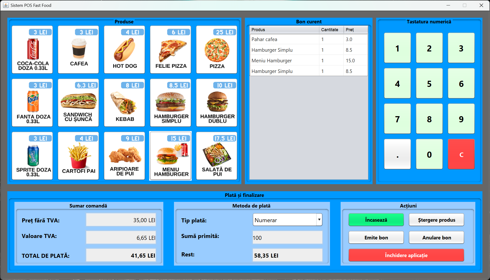

# Sistem POS Fast Food

Acest proiect reprezinta o aplicatie de tip POS (Point of Sale) pentru un restaurant fast food realizat în Java, folosind biblioteca Swing pentru interfata grafica. Aplicatia permite adaugarea produselor în comanda, calcularea preturilor si a TVA-ului, gestiunea platilor si emiterea bonurilor.



## Functionalitatile sistemului:
- Selectarea produselor cu un singur click
- Afisarea bonului curent cu toate produsele adaugate
- Calcularea automata a pretului total, TVA si pret fara TVA
- Posibilitatea de a alege metoda de plata (numerar, card, transfer)
- Calcularea restului pentru platile cu numerar
- Emitere bon si optiune de printare
- stergerea unui produs selectat
- Anularea întregului bon
- Tastatura numerica virtuala pentru introducerea sumelor

## Utilizare
Pentru a rula aplicatia, se deschide proiectul in NetBeans si se apasa pe butonul Run.

Alternativ, se poate compila si rula aplicatia din linia de comanda:
```bash
# Compilare
javac POS.java
# Rulare
java POS
```